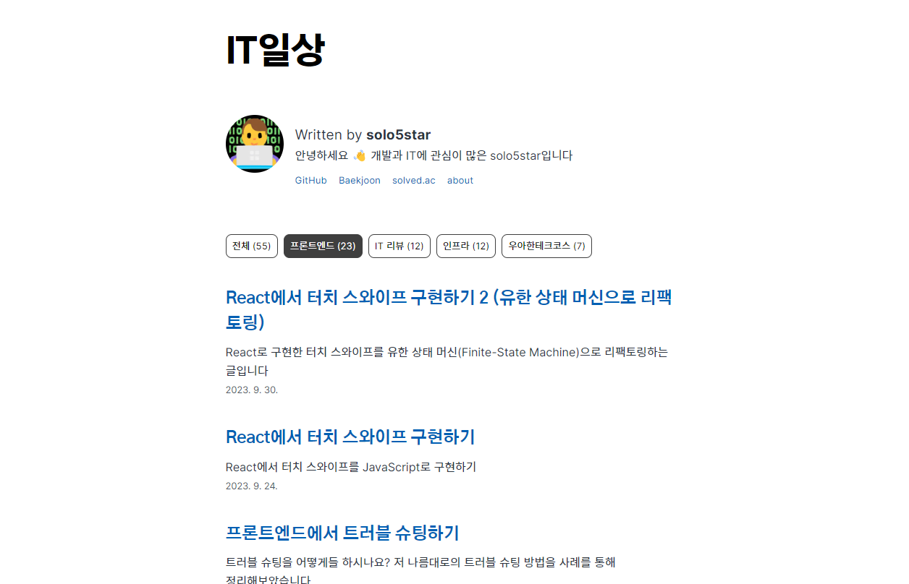
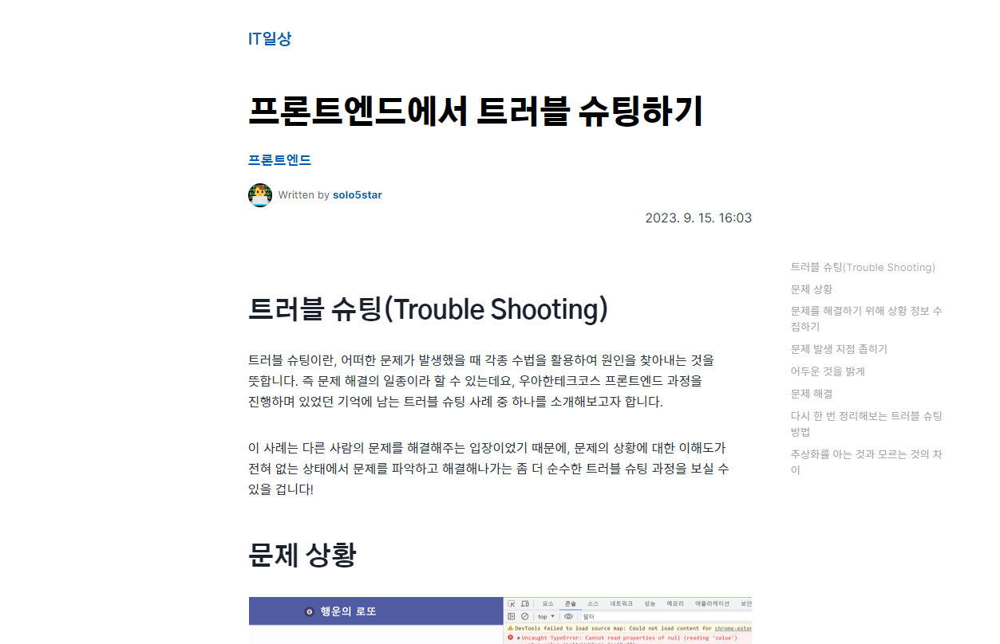

<!-- AUTO-GENERATED-CONTENT:START (STARTER) -->

  

<h1 align="center">
  solo5star's Blog
</h1>

This is personal blog for me. Currently **UNSTABLE**! (in hard working)

## Features

* Simple UI
* Based on MDX
* Category
* Code highlight, diff and filename at code block
* TOC
* Supports AWS S3/Cloudfront deployment with terraform IaC
